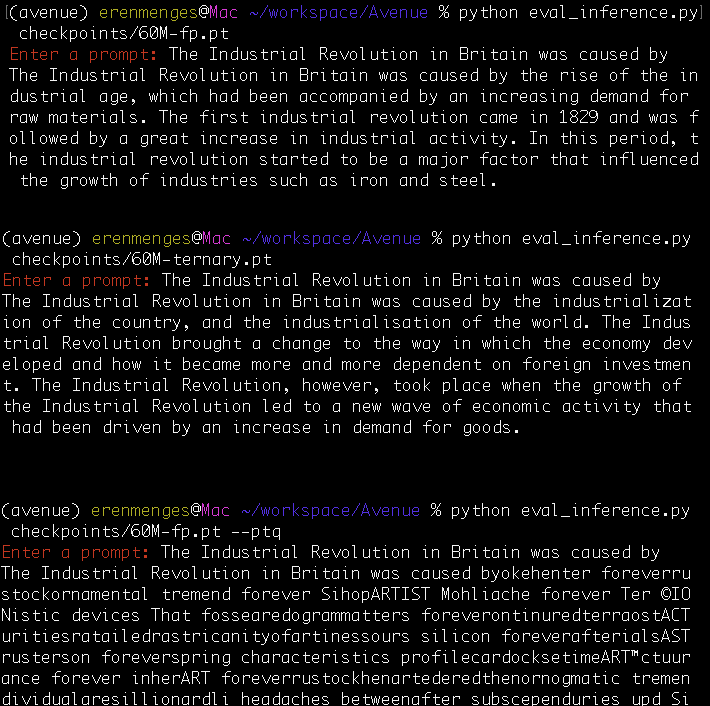
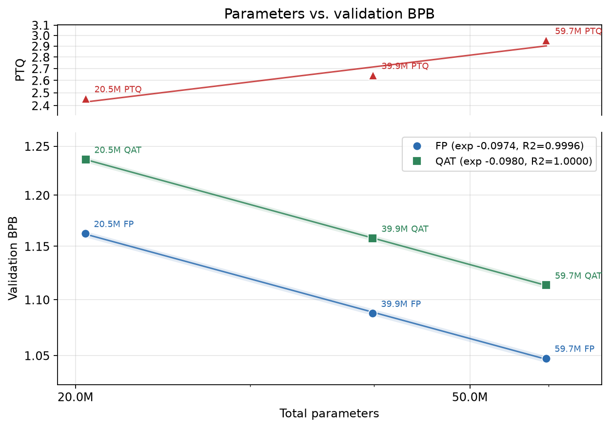
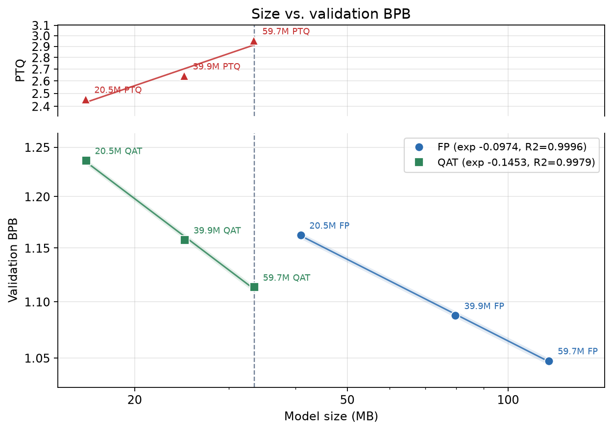
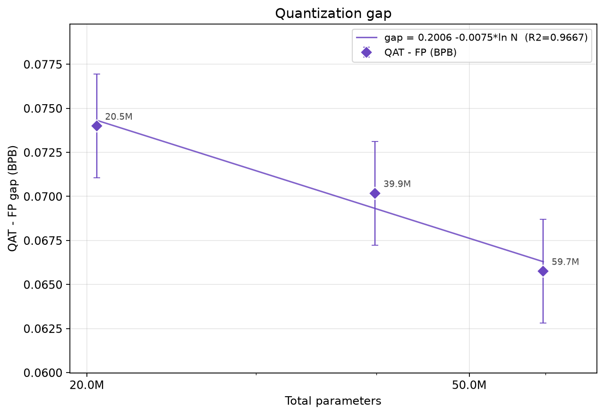

# Avenue
Avenue is a family of small, ternary-native language models, trained entirely on a MacBook Pro. This repository contains   a model class, training pipeline, and an inference stack, all custom and written by me. The models provide weight-only quantization support for Post-Training Quantization (PTQ) and, most importantly, BitNet style support for Quantization-aware Training (QAT). 

Avenue is named after the neighborhood I live in: East Village, NYC. The models come in different sizes:
- Avenue A: 20M 
- Avenue B: 40M
- Avenue C: 60M
Each model has two versions: FP and ternary. FP models are trained with full precision, like a regular language model. Ternary models are trained with a technique called Quantization-aware Training (QAT). The models are [available on HuggingFace](https://huggingface.co/erenmenges/Avenue/tree/main).

The models are Chinchilla-optimal, trained with a parameter-token_budget ratio of 1:20. The models have been trained on FineWeb-Edu's 10BT subset on HuggingFace.

Avenue is built fully by a human, using 0 lines of AI written code. It comes in sizes 20M, 40M, and 60M. I built this to see the difference between native FP and QAT training, and to demonstrate some scaling laws. Plus it's always good to have a custom Transformer lying around that I know every line and function by heart. 

Avenue is built on PyTorch's MPS backend. A viable next step would be to port it to MLX.

# Sample


The top one is 60M in full precision (FP), the middle one is 60M in ternary, and the bottom one is the 60M FP one quantized after training (PTQ).
See footnote 2 for more sample details.

# Features
Avenue consists of a model class, a tokenizer training pipeline, a model training pipeline, and an inference stack, all custom and written by me. 

- The model has all the modern techniques like RoPE and RMSNorm. 
- Tokenizer has vocab size 16384, trained on the whole 10B tokens.
- The training pipeline has a Muon/AdamW dual optimizer split, a custom LR schedule, weight decay for AdamW, and save resume functionality.
- The inference stack has top-p, top-k, and min-p sampling, alongside temperature and repetition penalty knobs.

# Results
BPB means bits per byte, which is derived from the validation loss and the training data's statistics after the tokenizer encoded it. Lower is better. **It's directly representative of model quality.**

## Number of total parameters vs BPB

## Size in bytes of model in memory vs BPB

## BPB gap between FP and ternary vs Number of total parameters



# Conclusions
1) Holding memory fixed, QAT beats FP in BPB. 60M ternary is ~33MB and has 1.11 BPB, compared to 20M FP which is ~41MB and has 1.16 BPB.
2) Ternary models cost ~6.4% more BPB than the FP models the same size. The band was extremely tight across 3 sizes, so I'm fairly confident in this number.
3) I've found that to get the same BPB as a FP model, a ternary model has to have ~1.9x more parameters. Both 3 models proved this, as visible on the lines.
4) PTQ is absolutely horrible. Don't do PTQ when you are working with ternary weights.

## How Ternary Works
I strongly recommend you read [the article I wrote on this](https://erenmenges.com/how-ternary-works) (without AI!). I had a very hard time trying to understand how ternary works, and there was no simple guide/math explainer for it. So I wrote one.

## Raw Results & Architecture Details

### Experiment Results
| arch | ptq | n_params | size_mb | val_loss | val_bpb | gap_vs_fp_nats |
| --- | --- | --- | --- | --- | --- | --- |
| fp | 0 | 20,453,760 | 40.91 | 3.353126 | 1.162311 | |
| ternary | 0 | 20,475,264 | 16.23 | 3.566596 | 1.236307 | 0.213470 |
| ternary | 1 | 20,481,408 | 16.19 | 7.075397 | 2.452581 | 3.722271 |
| fp | 0 | 39,856,640 | 79.71 | 3.137304 | 1.087500 | |
| ternary | 0 | 39,892,480 | 24.83 | 3.339756 | 1.157677 | 0.202452 |
| ternary | 1 | 39,902,720 | 24.76 | 7.618550 | 2.640857 | 4.481246 |
| fp | 0 | 59,651,200 | 119.30 | 3.022151 | 1.047584 | |
| ternary | 0 | 59,696,000 | 33.49 | 3.211849 | 1.113340 | 0.189698 |
| ternary | 1 | 59,708,800 | 33.40 | 8.513268 | 2.950998 | 5.491117 |

### Architecture and Training details

| Model  |   D |  K | H | Training Token Budget | muon_lr | adamw_lr | Ternary |
|--------|----:|---:|--:|----------------------:|--------:|---------:|:-------:|
| 20M-fp | 384 |  8 | 4 |           409,000,000 |  1.9e-3 |   1.9e-3 |  False  |
| 20M-tn | 384 |  8 | 4 |           409,000,000 |  2.1e-3 |   3.7e-3 |  True   |
| 40M-fp | 512 | 10 | 4 |           797,000,000 |  1.4e-3 |   1.4e-3 |  False  |
| 40M-tn | 512 | 10 | 4 |           797,000,000 |  1.6e-3 |   2.8e-3 |  True   |
| 60M-fp | 640 | 10 | 5 |         1,193,000,000 |  1.1e-3 |   1.1e-3 |  False  |
| 60M-tn | 640 | 10 | 5 |         1,193,000,000 |  1.3e-3 |   2.2e-3 |  True   |

The models have been trained on a MacBook Pro M5 Pro with 18-core CPU/20-core GPU and 64GB of unified memory. 6 models took 43.3 hours to train back to back. The LR's has been adjusted with D after a LR sweep at 7M params.

# Installation
## Requirements
- A MacBook
- Python 3.14
- PyTorch 2.12+
- A Weights&Biases account to see training logs
- 100-150GB disk space

## Setup
### uv
```bash
git clone https://github.com/erenmenges/Avenue.git
cd Avenue
uv sync
source .venv/bin/activate
```

### pip
```bash
git clone https://github.com/erenmenges/Avenue.git
cd Avenue
python3.14 -m venv .venv
source .venv/bin/activate
pip install -e .
```

### Wandb login (Weights&Biases dashboard, anyone can make a free account)
```bash
wandb login
```


# Usage
### Download the dataset and train the tokenizer
```bash
python train_tokenizer.py
```

### Tokenize the data
```bash
python prepare_data.py
```

### Train a model
You can either do:
1) Put your hyperparameters in config.py and do:
```bash
python train.py
```
or
```bash
python train.py --ternary
```
2) Pass your hyperparameters as CLI args:

```bash
python train.py --D 384 --K 8 --H 4 --token-budget 409000000 --muon-lr 1.9e-3 --adamw-lr 1.9e-3 --ternary
```

### Resume training from a checkpoint
```bash
python train.py --resume checkpoints/run_<id>/ckpt_20M_muon_m1.9e-03_a1.9e-03_step004800.pt
```
I advise you use a program like "Amphetamine" to keep your Mac from going to sleep while the training runs.

### Inference
```bash
python eval_inference.py checkpoints/run_<id>/final.pt
```
You should see:
```
Enter a prompt:
```

The sampling parameters are the default settings I found worked the best. To change them, just change the default numbers in the function signature of predict() in eval_inference.py.

### Evaluation
```bash
python final_results.py checkpoints/run_<id>/final.pt
```

For PTQ:
```bash
python final_results.py checkpoints/run_<id>/final.pt --ptq
```


# Training on a Mac & Future Work
Man, phew. This one was hard. Torch's MPS backend is brilliant but super slow for me. It took 43.3 hours for 6 models. And that was the optimized version. The non-optimized version would take around 1.7x more. I had to rewrite RoPE, use a new loss function (linear cross entropy) that computes the loss in chunks, and do a lot of sweeps to determine optimal number of attention heads.

I'll probably port this to MLX as the next step. Maybe I'll write some MLX kernels for ternary training even. Because right now ternary training is a ~9% overhead on FP training. We would still train latent weights but even if the kernel can eliminate the overhead, that's a win.

# Footnotes
1) The size of model in bytes is calculated from number of parameters and the 2 bit packing to be used. It is not measured from real disk storage. The actual model doesn't pack them during inference right now. That's for future work. However, the calculation is deterministic and pretty accurate.
2) The default settings in eval_inference.py were used to generate these samples. I also cut each to the first paragraph.